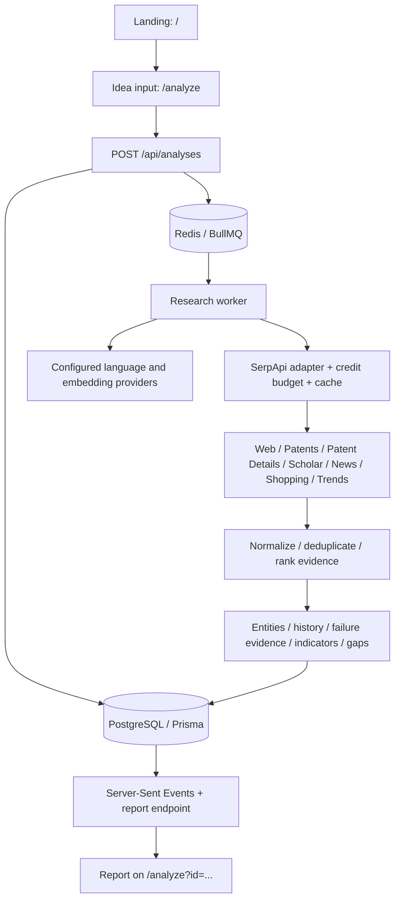

# IdeaXray

## Current source-first research flow

Research requires the database and SerpApi credentials. AI keys are optional. The brief and search queries are extracted in code; searches cover Google, Patents, Scholar, News and Trends, plus Shopping when physical-product keywords are detected. Physical-product routing is a heuristic, not a semantic guarantee. Searches and retries share `MAX_SEARCHES_PER_ANALYSIS` (default 6); a retry can leave a later source skipped, which is disclosed in the report.

Google parsing includes organic results, shopping blocks and knowledge panels when present. Related searches are displayed as suggestions, not treated as factual evidence. Relevant source and product cards are displayed without AI classification. Listings do not establish direct competition, availability or patent novelty. Commercial and crowding indicators remain unavailable without complete classification.

`AI_ENRICHMENT=true` enables optional opportunity and summary generation with source checks when Groq or OpenRouter credentials are configured. Set it to `false` for research without any AI calls. Existing reports retain their saved results; start a new analysis to collect Shopping and richer Google results.

The older architecture notes below describe earlier iterations; the current runtime flow above takes precedence.

**See what happened to your idea before you build it.**

IdeaXray investigates the patents, research, products, companies, news, trends, and earlier attempts surrounding a proposed idea. It helps students, inventors, researchers, makers, and founders understand existing evidence before investing time or resources.

The implementation now includes the database, background worker, all seven search adapters, AI and embedding abstractions, evidence processing, analysis APIs, live progress, and the complete report interface. There are exactly two product pages: `/` and `/analyze`.

**Validation status:** implementation has not been run or verified end to end. At your request, no tests, build, lint, type check, development server, migration, or live provider call was run. Tests and final local validation are left to you. Do not treat this as a verified production release. Dependencies were installed with lifecycle scripts disabled.

## Setup

Requirements: Node.js 22+, npm, Docker Compose, a SerpApi account, a chat-completion provider that supports JSON object responses, and an embedding model. The AI providers use an OpenAI-compatible HTTP contract but are not tied to a particular vendor or model.

From the `ideaxray` directory:

```powershell
Copy-Item .env.example .env
```

Fill in the keys, provider URLs, and model names in `.env`. If you previously made `.env.local`, consolidate its values into `.env` and avoid conflicting copies: Prisma reads `.env`, while Next.js and the worker also consider `.env.local`.

```powershell
npm ci
npm run services:up
npm run db:generate
npm run db:migrate
```

The checked-in migration creates the schema. `db:generate` creates the Prisma client; run it before starting the app or running TypeScript checks. These commands are provided for you and were not executed during implementation.

Start the web app:

```powershell
npm run dev
```

In a second terminal, from the same directory:

```powershell
npm run worker
```

Open http://localhost:3000. Visit `/api/health` to check configuration, PostgreSQL, Redis, and worker availability. Health checks do not contact paid search or AI providers and cannot verify API key validity. The landing/input pages are usable without provider keys after dependency and Prisma-client setup; attempting research explains missing configuration.

## Environment variables

| Variable | Purpose |
| --- | --- |
| `SERPAPI_API_KEY` | Required search provider credential; server-only |
| `LLM_API_KEY` | Required AI provider credential; server-only |
| `LLM_BASE_URL` | Provider API base, including `/v1` when required; requests append `/chat/completions` |
| `LLM_MODEL` | Chat model that supports `response_format: {type: "json_object"}` |
| `EMBEDDING_MODEL` | Embedding model used for relevance and semantic deduplication |
| `EMBEDDING_BASE_URL` | Optional separate embedding base; requests append `/embeddings`; defaults to `LLM_BASE_URL` |
| `EMBEDDING_API_KEY` | Optional separate embedding key; defaults to `LLM_API_KEY` |
| `DATABASE_URL` | PostgreSQL connection URL |
| `POSTGRES_PASSWORD` | Password used by the local Compose PostgreSQL service; keep it consistent with `DATABASE_URL` |
| `REDIS_URL` | `redis://` or `rediss://` connection URL |
| `APP_URL` | Browser origin used for same-origin write protection; default `http://localhost:3000` |
| `SEARCH_TIMEOUT_MS` | SerpApi request timeout; default 30000 |
| `AI_TIMEOUT_MS` | AI request timeout; default 60000 |
| `MIN_SERPAPI_CREDITS` | Minimum account balance before a job starts; at least 12, default 12 |
| `RELEVANCE_THRESHOLD` | Embedding cosine similarity multiplied by 100; default threshold 40 |
| `WORKER_CONCURRENCY` | Simultaneous report jobs; default 2 |
| `RATE_LIMIT_PER_HOUR` | Creation/retry requests per browser session; default 5 |
| `GLOBAL_ANALYSES_PER_HOUR` | Global creation/retry ceiling; default 50 |
| `TRUST_PROXY` | Enable IP rate limiting only if a trusted reverse proxy replaces `X-Forwarded-For`; default false |

Provider endpoints must use HTTPS, except HTTP on localhost for local compatible services. Provider configuration comes only from environment variables, never from submitted idea text. No arbitrary source URL fetching is performed.

Never expose provider keys with `NEXT_PUBLIC_`. Environment files are ignored; `.env.example` has blank provider credentials and local development service defaults. Use strong credentials and protected services before hosting.

## Commands

| Command | Purpose |
| --- | --- |
| `npm run dev` | Next.js development server |
| `npm run worker` | Standalone BullMQ research worker |
| `npm run worker:dev` | Restart the worker when its imported files change |
| `npm run services:up` | Start PostgreSQL and Redis with persistent local volumes |
| `npm run services:down` | Stop services, preserving volumes |
| `npm run db:generate` | Generate the Prisma client |
| `npm run db:migrate` | Apply checked-in migrations |
| `npm run db:dev` | Create/apply migrations during future schema development |
| `npm run db:studio` | Inspect local persisted data |
| `npm run lint` | ESLint, for you to run |
| `npm run typecheck` | TypeScript checks, for you to run after Prisma generation |
| `npm run build` | Production build, for you to run |
| `npm start` | Serve the production build |

The worker needs its own long-lived Node.js process. Its command enables the `react-server` export condition so shared `server-only` modules remain protected in Next.js while also running in the standalone worker. Keep the worker and app on the same database and Redis services. For production, install the worker runtime dependencies, including `tsx`, or separately compile the worker in your deployment process.

Docker Compose binds the two development services to localhost, persists their data, and gives Redis `noeviction`. It does not start the web app or worker. Do not remove volumes unless you intend to delete stored reports.

## Architecture



The database stores analyses, query plans, search runs, sanitized raw responses, all normalized evidence, extracted entities, dated events, insights and their many-to-many citations, trend points, and expiring search-cache entries. The serialized report is stored with the analysis for refresh restoration.

## Why SerpApi is essential

Search evidence is the application's foundation. AI decomposes an idea, plans queries, classifies returned material, and helps synthesize cited findings; it does not invent sources. The server uses the official `serpapi` npm SDK with structured JSON responses and default upstream caching.

| Engine | Role | Application cache TTL |
| --- | --- | --- |
| `google` | Competitors, company status, failure-oriented follow-up searches | 48 hours |
| `google_patents` | Related inventions, inventors, assignees, dates, publication numbers | 7 days |
| `google_patents_details` | Top relevant patent abstracts, classifications, keywords, legal events | 7 days |
| `google_scholar` | Papers, publication details, authors, citation signals | 7 days |
| `google_news` | Launches, company events, recent market activity | 6 hours |
| `google_shopping` | Commercial products and available prices | 12 hours |
| `google_trends` | Five-year relative interest series and momentum | 24 hours |

Standard and Deep each have a **hard ceiling of 12 remote search attempts per job attempt, including retries**. The base plan has nine searches. Standard reserves one remaining slot for status investigation of a discovered entity, and can use two for patent details. Deep can reserve two status searches and use one patent-detail slot, while requesting more patent, Scholar, and web results. If no entities need follow-up, up to three patents can be enriched. Cache hits consume no remote-attempt budget. Temporary retries can reduce remaining coverage; every skipped/failed search is disclosed. A manual report retry has a new budget and may use credits again.

The SerpApi Account API is checked before research. Calls to that account endpoint are not search queries. Searches run with bounded parallelism; timeouts and bounded exponential retries prevent endless attempts. A failed engine yields a partial report when other sources remain usable.

## Evidence and analysis rules

- URL, publication-number, normalized-title, entity-name, and high-threshold embedding similarity are used to reduce duplicates. Distinct patent publication numbers are not merged by embedding similarity alone.
- All normalized evidence stays stored, including duplicates and below-threshold results. Only retained evidence contributes to counts and indicators.
- Similarity uses an abstract `EmbeddingProvider`; no search-rank-only fallback masquerades as relevance. If embedding ranking fails, unranked evidence stays excluded and the report is marked partial.
- Entity extraction accepts only names found in supplied text, with references to retained evidence.
- Timeline events use explicit source dates, not model-invented dates. Year-only dates are displayed as years. Relative dates such as “2 days ago” are not guessed.
- Failure analysis checks exact source excerpts and uses conservative confirmation: at least two distinct publisher domains, independently classified reporting, and no near-identical copied quotes. A single source remains possible rather than confirmed. Conflicting activity/discontinuation evidence stays unclear. Acquisition does not establish failure. Full-text source verification remains a human review step.
- Opportunity suggestions require lower comparative concept coverage, research feasibility citations, comparative citations, and usable non-strongly-negative trend evidence. Unknown trend support or insufficient evidence can correctly yield no suggestions. All confidence is capped at medium.
- Citation IDs are checked against the supplied retained evidence. Unsupported IDs and explicit prohibited legal/success wording are rejected. Source content is untrusted text in model prompts. These controls reduce, but cannot guarantee elimination of, model interpretation errors.
- Patent, research, commercial, momentum, and crowding indicators are transparent research heuristics. They are not legal, investment, novelty, or patentability assessments.
- Google Trends values are relative 0–100 indices, not absolute search volumes. The momentum heuristic compares the last two equal windows. Missing volume yields no momentum estimate.

The report includes summary, retained landscape counts, indicators, existing solutions, patents, research, history, failure archaeology, concept coverage, opportunity areas, a focused interactive map, search trace, and a filterable source browser. All sources can be inspected; a report can be exported as JSON.

## Routes and privacy

| Route | Behavior |
| --- | --- |
| `POST /api/analyses` | Validate input, check setup, rate limit, persist and enqueue; returns analysis ID and `QUEUED` |
| `GET /api/analyses/:id` | Restore status or full report for the owning browser session |
| `GET /api/analyses/:id/events` | Stream actual persisted progress; reconnects between bounded streaming sessions |
| `POST /api/analyses/:id/retry` | Retry failed/partial analyses, with at most three manual retries |
| `GET /api/health` | Database/Redis/worker/configuration readiness; no paid provider calls |

Reports belong to an anonymous browser session using an HttpOnly cookie. An analysis ID alone does not grant access. Clearing the cookie, changing browser profiles, or waiting past its lifetime loses access through the UI; this is not a cross-device account system. Same-origin writes and bounded JSON bodies are enforced. Creation and retry share rate limits.

The landing-to-analysis transition carries the original idea in a query string, as specified, so it can appear in browser history/server access logs. Subsequent analyses use IDs. Actual research sends idea text and evidence to the configured AI/embedding providers and generated queries to SerpApi. The interface discloses this before submission. Application logs avoid submitted ideas, raw provider errors, and credentials. Search records are recursively scrubbed of secret fields and configured key values.

No automatic data-retention/deletion schedule is enabled. Operators should define one before public hosting. Cached payloads may include query text. Stale entries are replaced on reuse; expired unused entries can be removed during database maintenance.

## Design and project layout

The sibling `../design/` reference remains untouched. The app follows its white canvas, warm neutral surfaces, lime accent, Inter body type, Inter Tight display substitute, pill controls, 20px panel corners, and photographic hero. Report layouts extend the same palette and geometry.

```text
app/                       Two product pages, shared layout, API routes
components/analysis/       Input/progress/report interface
components/evidence/       Citations, source filters, evidence dialog
components/graph/          Interactive React Flow idea map
components/trends/         Recharts history and interest charts
src/lib/                   Shared contracts, validation, safe URL utilities
src/server/ai/             Language/embedding abstractions and evidence analysis
src/server/serpapi/        Official SDK adapter and seven engine configurations
src/server/normalization/  Deduplication and similarity helpers
src/server/scoring/        Coverage, activity, momentum, crowding heuristics
src/server/analysis/       Planning, orchestration, persistence, report retrieval
src/server/http/           Session ownership, rate limits, validation
src/server/queue/          Redis and BullMQ setup
src/server/db/             Prisma client
worker/                    Standalone research worker
prisma/                    Data model and initial migration
public/images/             Local photographic asset
```

The hero background, `public/images/forest-canopy-ai.webp`, was generated on September 23, 2026 using OpenAI's built-in image generation through Codex. It was created from a text prompt without an input photograph and replaces the previous internet-sourced image. The full prompt and generation details are saved in `public/images/forest-canopy-ai.provenance.json`. Fonts use `next/font/google`; the initial run/build requires font-download access.

## Testing and demonstration

No tests were written or executed, honoring the request to leave testing to you. There is no misleading passing-test claim or placeholder test script. The specification's Vitest/Playwright/fixture stage remains deferred. See [validation checklist](docs/validation.md) for the intended coverage and [implementation handoff](docs/implementation.md) for scope and decisions.

After setup, use this short demonstration:

1. Enter “A backpack that automatically follows its owner using computer vision.”
2. Start research on `/analyze` and show real progress.
3. Refresh to demonstrate restoration of the running job.
4. Inspect patents, academic research, and related products.
5. Show history, previous-attempt status, and coverage/opportunities. An empty opportunity section is valid when evidence is insufficient.
6. Select an idea-map node and open its source.
7. Show Search Trace with queries, retained counts, request durations, and SerpApi search IDs.
8. Export the report.

For a sub-three-minute recording, complete setup beforehand and consider recording an existing finished report after showing the beginning of a real run. No fixed completion time is guaranteed.

## Limitations, disclosure, and track

This is a bounded investigation, not an exhaustive patent search or legal opinion. SerpApi snippets, publisher independence, entity names, provider output shapes, embedding thresholds, and model judgments need real-data validation. Prices and company statuses are snapshots of retrieved evidence. Current Google region support is uneven: patents/Scholar provide global context, Europe market queries use wording instead of a country code, and worldwide/Europe Trends use global interest. The map is a curated subset; the source browser retains the complete normalized dataset.

ChatGPT assisted code generation. OpenAI Codex assisted implementation, review, fixes, tests, and documentation; its built-in image-generation tool created the current forest hero background. Runtime AI comes from the provider you configure. No fictional findings are seeded into the interface.

Hackathon track: **Knowledge & Public Interest**.

Primary implementation references: [SerpApi JavaScript SDK](https://github.com/serpapi/serpapi-javascript), [SerpApi Account API](https://serpapi.com/account-api), [BullMQ connections](https://docs.bullmq.io/guide/connections), [Prisma 6 schema reference](https://docs.prisma.io/docs/orm/v6/reference/prisma-schema-reference), and the installed Next.js route-handler documentation.
